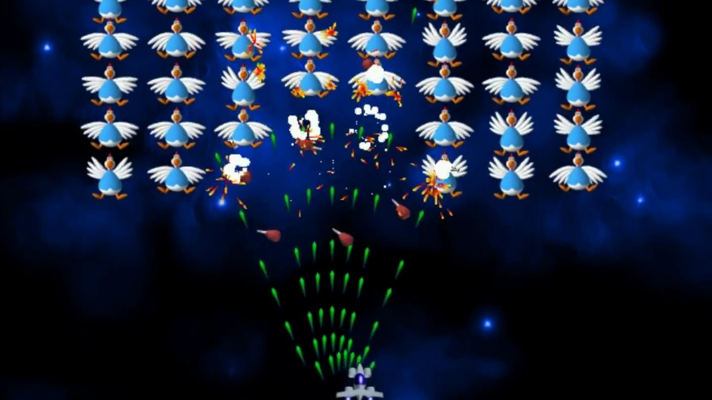
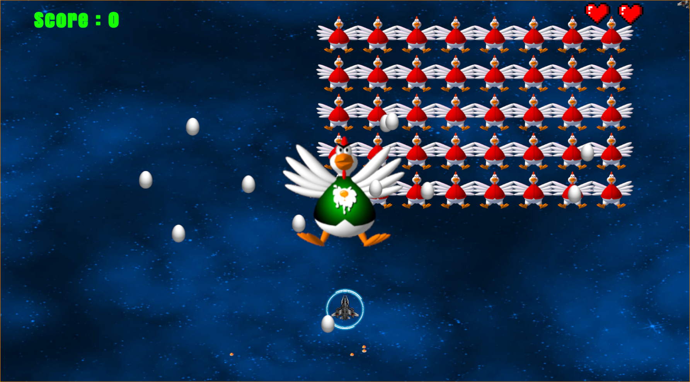

# 🚀🐤 CHICKEN_SHOOTER_2D  🛰️🐔🥚

**CHICKEN_SHOOTER_2D** là một trò chơi **bắn súng không gian 2D** được phát triển bằng **Unity**, nơi người chơi điều khiển phi thuyền chiến đấu chống lại đàn gà ngoài hành tinh.  
Nhiệm vụ của bạn là **tiêu diệt kẻ thù**, **né tránh đạn trứng**, **thu thập vật phẩm nâng cấp** và **giải cứu Trái Đất khỏi thảm họa xâm lăng**.  

---

## 📸 Screenshot  
 

- Boss And Chicken 


---

## 🎮 Giới thiệu  

- **Thể loại:** Shoot 'em Up / Arcade  
- **Lấy cảm hứng từ:** Huyền thoại **Space Invaders** và dòng game **Chicken Invaders**  
- **Đặc điểm:** Gameplay nhanh, kịch tính nhưng cũng hài hước  
- **Trải nghiệm:** Bắn hạ từng đợt gà, né tránh trứng rơi và nâng cấp vũ khí để sống sót  

---

## 🧑‍💻 Thông tin sinh viên thực hiện  

- **Họ tên:** Quách Thành Long  
- **Email:** longqt.124010124034@vtc.edu.vn  
- **Lớp học phần:** K24GD-03-2D Game Engine  
- **Giờ học:** 8h30 – 11h30  
- **Giảng viên hướng dẫn:** Thầy Nguyễn Trung Hiếu  

---

## 🚀 Tính năng nổi bật  

- 🚀 **Điều khiển phi thuyền dễ dàng** (di chuyển và bắn)  
- 🐔 **Đàn gà kẻ thù** đông đảo, với nhiều kiểu di chuyển khác nhau  
- 🎨 **Đồ họa 2D retro** vui nhộn và bắt mắt  
- 🔊 **Âm thanh & hiệu ứng sống động**, mang lại cảm giác arcade cổ điển  
- 💣 **Power-ups đa dạng** giúp tăng sức mạnh hỏa lực  
- 👾 **Nhiều màn chơi** với độ khó tăng dần và boss cuối thử thách  

---

## 🛠️ Công nghệ sử dụng  

- **Game Engine:** Unity 2D  
- **Ngôn ngữ:** C#  
- **Thiết kế đồ họa:** Sprite Editor / Aseprite  
- **Quản lý mã nguồn:** GitHub  

---

## 📦 Cài đặt & chạy game  

```bash
# Clone repo
git clone https://github.com/StephenSouth13/Chicken_Shooter_2D.git

# Mở project trong Unity Hub và bấm Play để chạy game
