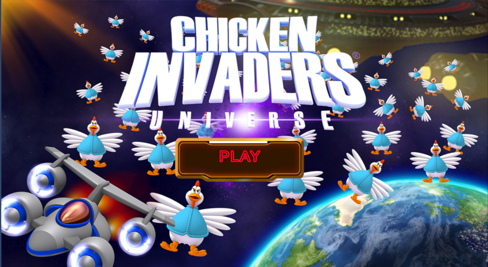

# 🚀🐤 CHICKEN_SHOOTER_2D 🛰️🐔🥚

**CHICKEN_SHOOTER_2D** is a fast-paced, retro-style **2D space shooter** built with **Unity**, where players pilot a spaceship to battle an endless invasion of alien chickens.  
Your mission: **eliminate enemies**, **dodge deadly egg projectiles**, **collect power-ups**, and **save Earth from cosmic poultry domination**.

---

## 📸 Screenshots

- Hero  
  

- Gameplay  
  

- Boss & Chicken  
  

---

## 🎮 Game Overview

- **Genre:** Shoot 'em Up / Arcade  
- **Inspired by:** The legendary **Space Invaders** and the iconic **Chicken Invaders** series  
- **Style:** Fast, chaotic, and humorously absurd  
- **Experience:** Blast through waves of chickens, dodge falling eggs, and upgrade your arsenal to survive the madness

---

## 🧑‍💻 Developer Info

- **Name:** Quách Thành Long  
- **Email:** longqt.124010124034@vtc.edu.vn  
- **Class:** K24GD-03 – 2D Game Engine  
- **Schedule:** 8:30 AM – 11:30 AM  
- **Instructor:** Mr. Nguyễn Trung Hiếu

---

## 🚀 Key Features

- 🎮 **Smooth spaceship controls** for movement and shooting  
- 🐔 **Swarming chicken enemies** with varied attack patterns  
- 🎨 **Colorful retro 2D graphics** with a humorous twist  
- 🔊 **Dynamic sound effects & arcade-style audio**  
- 💣 **Diverse power-ups** to boost your firepower  
- 👾 **Multiple levels** with escalating difficulty and epic boss fights

---

## 🛠️ Technologies Used

- **Game Engine:** Unity 2D  
- **Programming Language:** C#  
- **Graphics Design:** Sprite Editor / Aseprite  
- **Version Control:** GitHub

---

## 📦 Installation & Run

```bash
# Clone the repository
git clone https://github.com/StephenSouth13/Chicken_Shooter_2D.git
---

# 💬 Final Note
- This project is a tribute to classic arcade shooters, reimagined with a quirky twist. Whether you're dodging eggs or blasting through chicken bosses, CHICKEN_SHOOTER_2D promises a fun and chaotic ride through space.
Enjoy the game — and may your aim be true! 🛸🔥

# Click 'Play' to launch the game